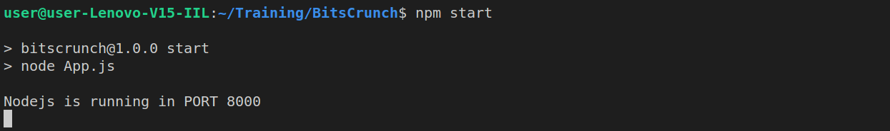
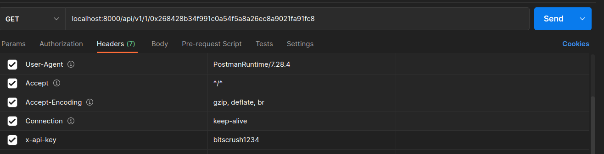
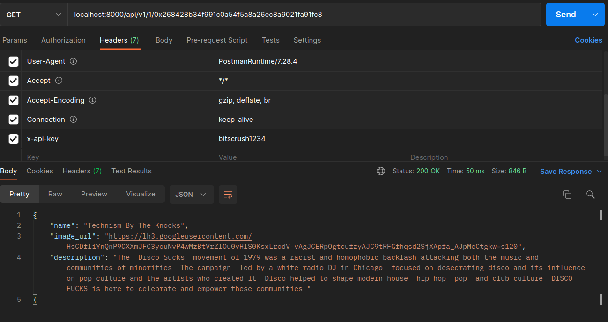
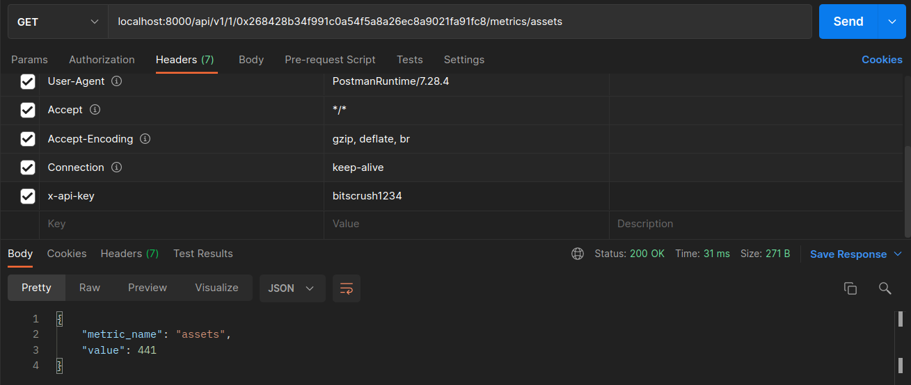
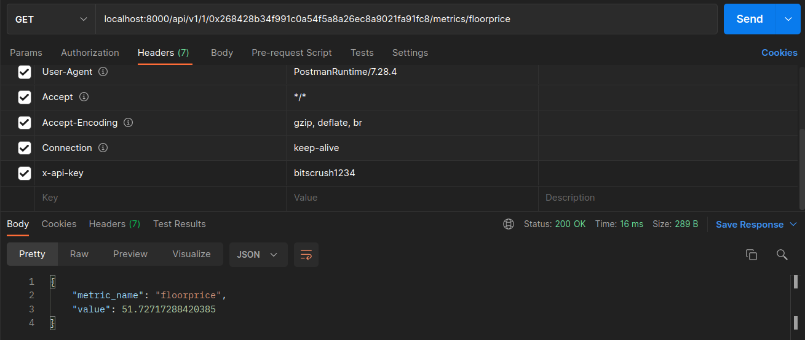
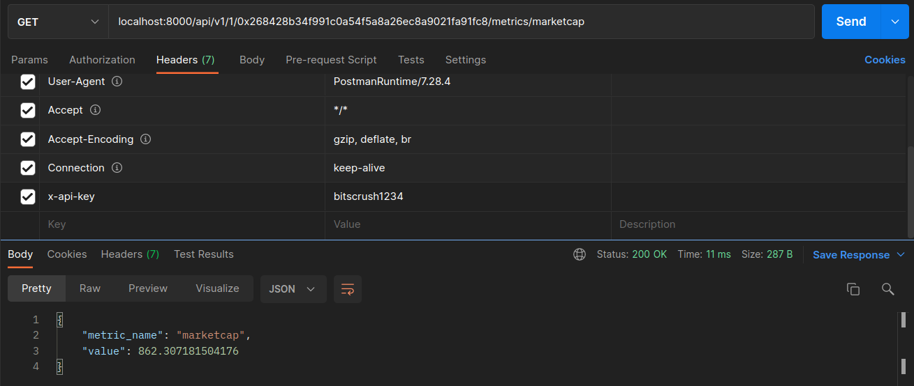
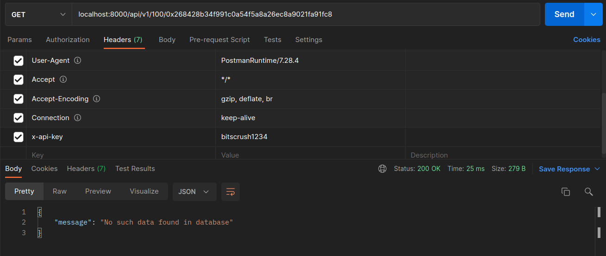
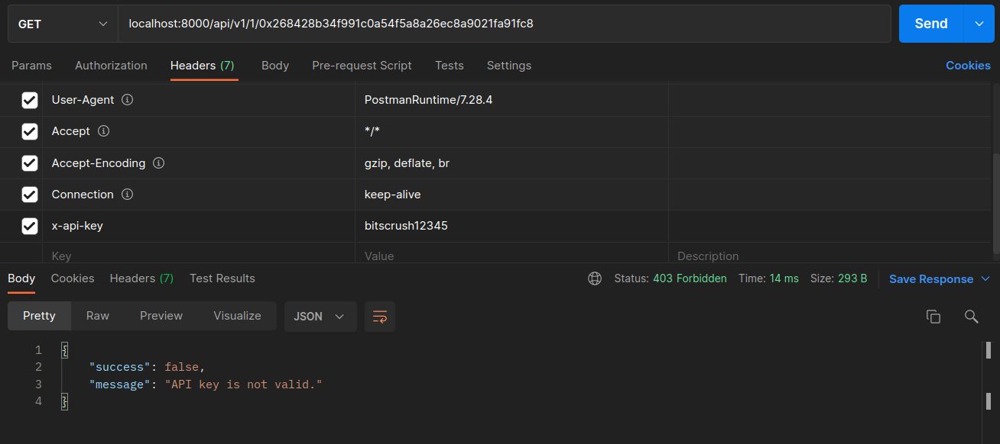

# BitsCrunch 🛡️ NodeJs API Task
This Project is built with MVC Architecture.

Additionally Includes:
- Api-key Validation -To restrict unauthorized access
- Common Error Handler
- Loggers -To log each and every activity of server

## Instructions 🚀
Open your Terminal in VsCode and follow the below instructions 

## STEP 1 - Install Node modules 🎒

`npm i`

### Change the `sample.env` file to `.env`   ⚠️  

## STEP 2 - Boot Our Nodejs Application 🛠️

`npm start`



## STEP 3 - Required API as per Mentioned in Task Documentation 📝

## Note: Pass the API Key in Headers of Request 🔑

In Headers
| Key | Value     | 
| :-------- | :------- |
| `x-api-key` | `bitscrush1234` |



## Get Asset Data

```
HTTP GET Request :

localhost:8000/api/v1/1/0x268428b34f991c0a54f5a8a26ec8a9021fa91fc8
```

| Parameter | Type     | Description                |
| :-------- | :------- | :------------------------- |
| `chain_id` | `Number` | TO REPRESENT PARTICULAR CHAIN ID |
| `ethereum_address` | `address` | TO FETCH DATA OF THAT ETH ADDRESS |

```
Output JSON RESPONSE:
{
    "name": "Technism By The Knocks",
    "image_url": "https://lh3.googleusercontent.com/HsCDfliYnQnP9GXXmJFC3youNvP4wMzBtVrZlOu0vHlS0KsxLrodV-vAgJCERpOgtcufzyAJC9tRFGfhqsd2SjXApfa_AJpMeCtgkw=s120",
    "description": "The  Disco Sucks  movement of 1979 was a racist and homophobic backlash attacking both the music and communities of minorities  The campaign  led by a white radio DJ in Chicago  focused on desecrating disco and its influence on pop culture and the artists who created it  Disco helped to shape modern house  hip hop  pop  and club culture  DISCO FUCKS is here to celebrate and empower these communities "
}

```


## Get Asset Metric Value 💰

```
HTTP GET Request :

localhost:8000/api/v1/1/0x268428b34f991c0a54f5a8a26ec8a9021fa91fc8/metrics/assets
```

| Parameter | Type     | Description                |
| :-------- | :------- | :------------------------- |
| `chain_id` | `Number` | TO REPRESENT PARTICULAR CHAIN ID |
| `ethereum_address` | `address` | TO FETCH DATA OF THAT ETH ADDRESS |

```
Output JSON RESPONSE:
{
    "metric_name": "assets",
    "value": 441
}
```

## Get Asset Metric Floorprice 📊 

```
HTTP GET Request :

localhost:8000/api/v1/1/0x268428b34f991c0a54f5a8a26ec8a9021fa91fc8/metrics/floorprice
```

| Parameter | Type     | Description                |
| :-------- | :------- | :------------------------- |
| `chain_id` | `Number` | TO REPRESENT PARTICULAR CHAIN ID |
| `ethereum_address` | `address` | TO FETCH DATA OF THAT ETH ADDRESS |

```
Output JSON RESPONSE:
{
    "metric_name": "floorprice",
    "value": 51.72717288420385
}
```

## Get Asset Metric Marketcap 📈 

```
HTTP GET Request :

localhost:8000/api/v1/1/0x268428b34f991c0a54f5a8a26ec8a9021fa91fc8/metrics/marketcap
```

| Parameter | Type     | Description                |
| :-------- | :------- | :------------------------- |
| `chain_id` | `Number` | TO REPRESENT PARTICULAR CHAIN ID |
| `ethereum_address` | `address` | TO FETCH DATA OF THAT ETH ADDRESS |

```
Output JSON RESPONSE:
{
    "metric_name": "marketcap",
    "value": 862.307181504176
}
```


## Screenshots of PostMan Response 👀

### Get Asset Data

### Get Asset Metric Value

### Get Asset Metric Floorprice

### Get Asset Metric Marketcap

## Retuns Message if data doesn't exist in DB

## Retuns Error if API-Key is not valid
